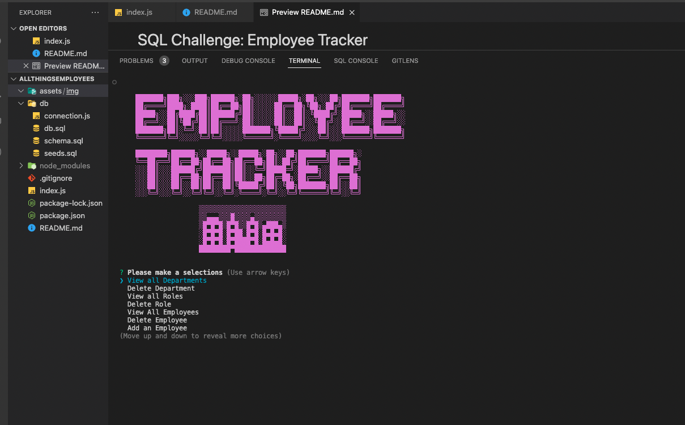

# SQL Challenge: Employee Tracker

## Purpose

Create a database where an owner/manager can manage the departments, roles, and employees in the company.

## Requirements

GIVEN a command-line application that accepts user input. Upon starting the application the user must be presented with:

- The following options: view all departments, view all roles, view all employees, add a department, add a role, add an employee, and update an employee role.
- When the user selects view all departments a formatted table should presented with department names and department ids.
- When a user selects view all roles a formatted table should be presented with job titles, role id, the department the role belongs to and the salary for that role.
- When a user selects all employees a formatted table should be presented with employee data, including employee ids, first names, last names, job titles, departments, salaries, and managers that the employees report to.
- When a user chooses to add a department then the user is prompted to enter the name of the department and that department is added to the database.
- When a user chooses to add a role then the user is prompted to enter the name, salary, and department for the role and that role is added to the database.
- When a user chooses to add a new employee then the user is prompted to enter the employee’s first name, last name, role, and manager, and that employee is added to the database.
- When a user chooses to update an employees role then the user is prompted to select an employee to update and their new role and this information is updated in the database.

## Screencastify

https://drive.google.com/file/d/1Q6yH3UDsjyU5sohQf9VFCbBZvzp565zc/view

## Website

https://hartsfieldt.github.io/allthingsemployees/

## Git Hub

https://github.com/hartsfieldt/allthingsemployees

## Installation

Run "npm i" to install the required modules
Download MYSQL use: mysql -u root -p

## Contribution

Made with ❤️ by Teresa Hartsfield

## Front End

## Back End

